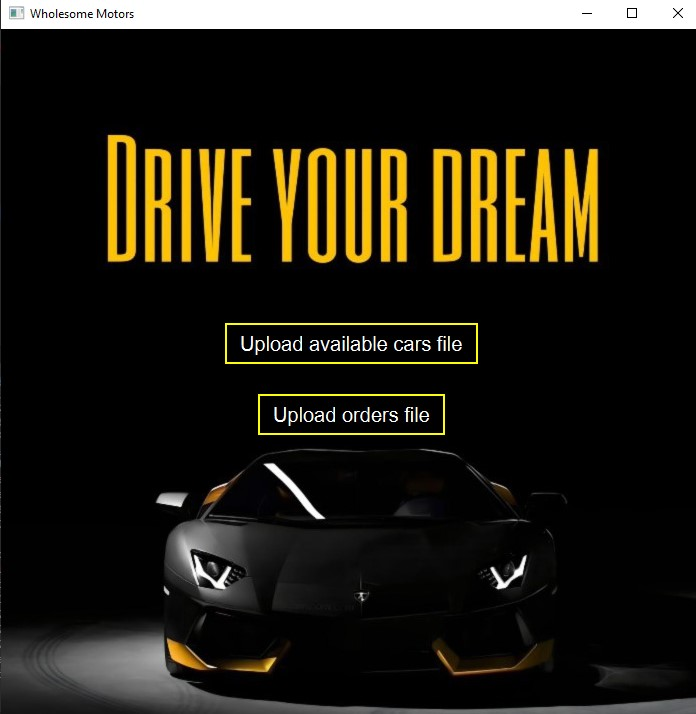
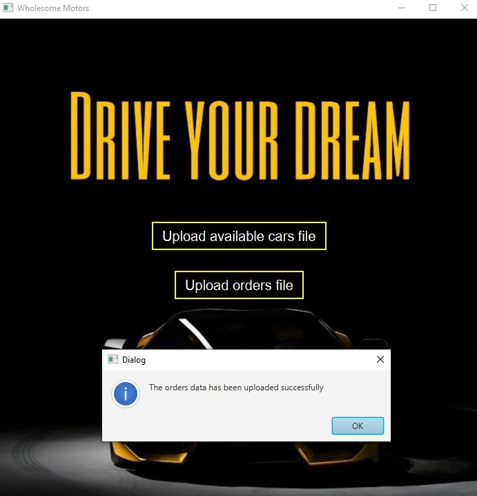
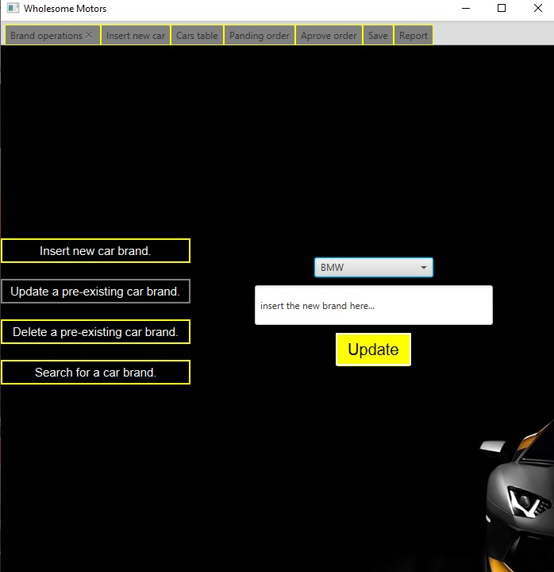
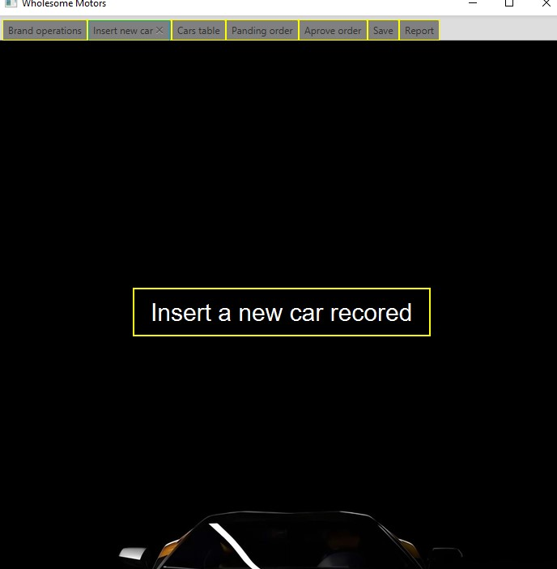
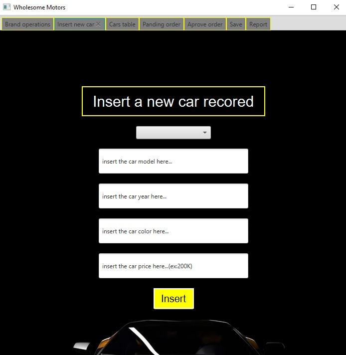
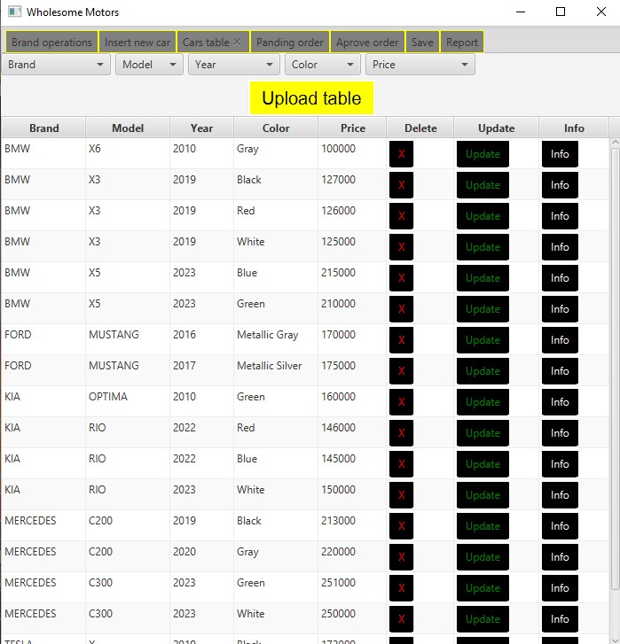
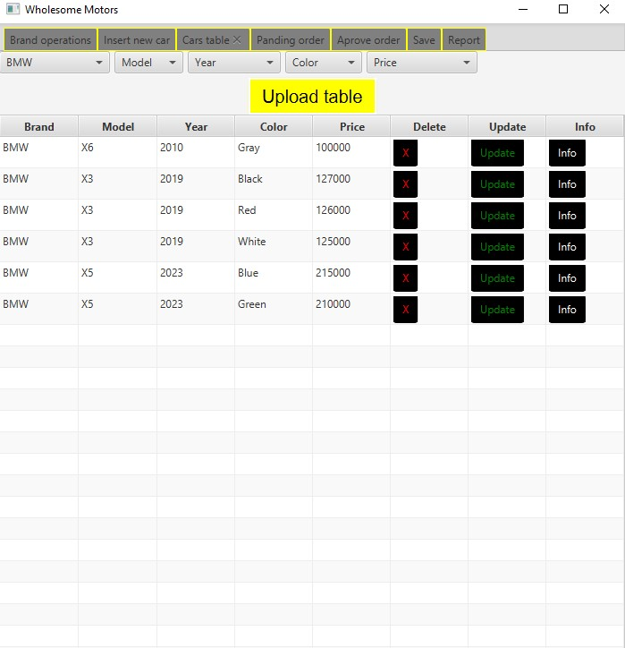
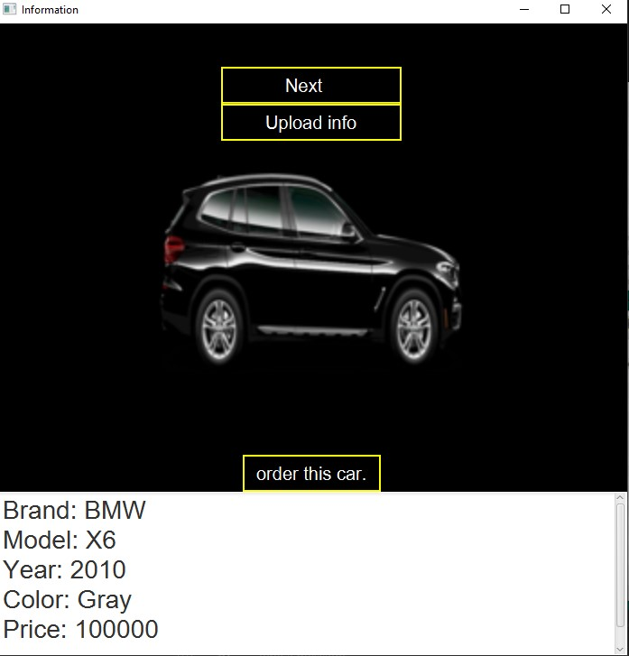
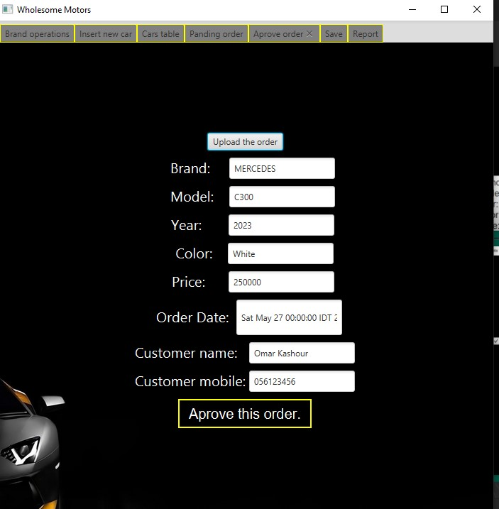
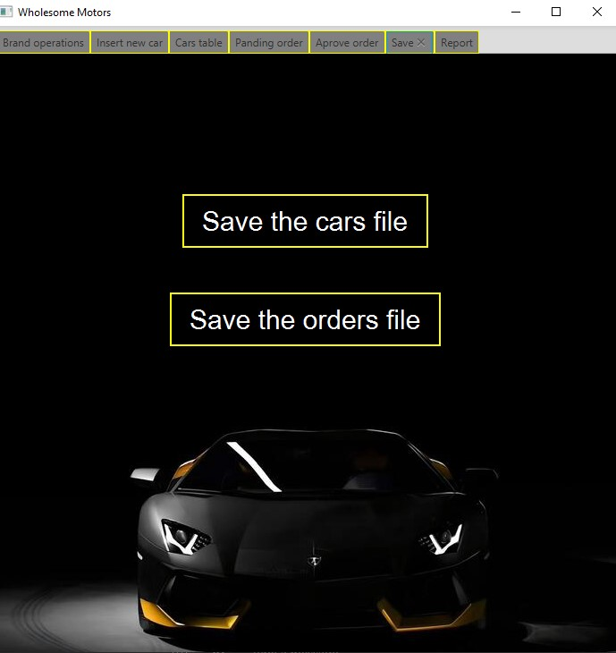

# 🚗 Car Agency Application

**Car Agency Application** is a system designed to manage car inventory, process customer orders, and maintain records of sold cars.

## 📝 Note

**This project was awarded a full mark by Dr. Iyad Jaber <3.**

## 🔧 Data Structures

This project implements a car inventory management system using a combination of data structures to efficiently store and access car data. The overall data structure includes:

- **Double Linked List of Car Brands:**
  - Each brand node contains a **Single Linked List** of cars sorted by year.
  - Cars are sorted alphabetically by brand and within each brand by the year of manufacture.

- **Queues:**
  - Customer orders are processed using a queue (First Come, First Served).
  
- **Stacks:**
  - Sold cars are stored in a stack for easy access to the most recently sold cars.

## 💻 Main Interface

The main interface allows administrators to manage car inventory, process customer orders, and track sold cars.

## 🚨 Data Upload Notification

Notifications indicate successful data upload and any issues encountered during processing.

## 🚘 Car Inventory Management

Administrators can:

- Add new car brands and models.
- Update or delete existing car records.
- Search for specific cars using filters such as year, color, model, or price.

## 📋 Customer Order Management

Customers can browse available cars, apply filters, and place orders.

## 📊 Order Processing

The admin can process customer orders, moving completed orders to a stack of finished orders. If a car is unavailable, the order can be postponed.

## 📈 Statistics
- **Reporting:** Generate reports on the last 10 sold cars.

## 💾 Save Order File

Administrators can save processed orders to a file for future reference.

